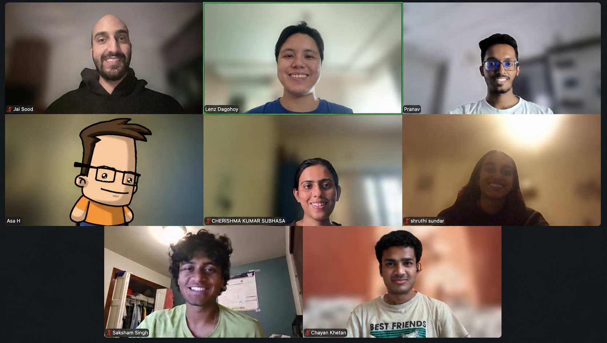
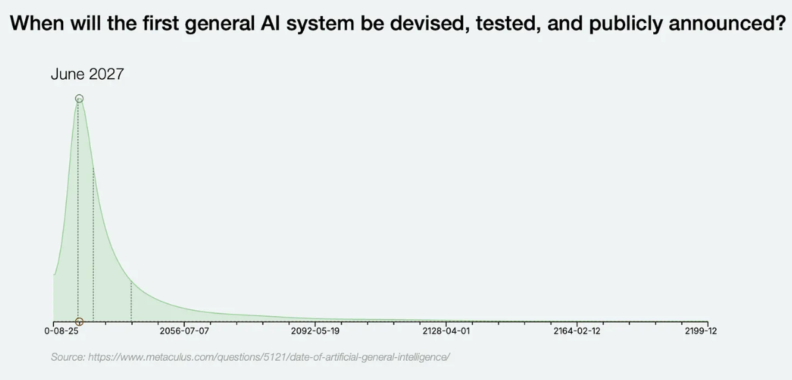
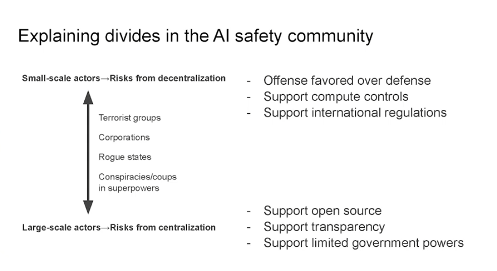

Earlier this year [I stumbled across Brian Chistian's "The Alignment Problem: Machine Learning and Human Values"](https://www.goodreads.com/review/show/8471284243), which introduced me to the topic of AI Alignment (and more broadly, AI Safety). The idea was a new one for me, but it resonated strongly; in (extraordinarily) brief terms: AI safety concerns itself with the idea of how we can assure that the progression of large language models and AI more generally does not lead to human harm, accidentally or deliberately. 

[Christian's book](https://www.amazon.com/Alignment-Problem-Machine-Learning-Values/dp/B085DTXC59/ref=sr_1_1?sr=8-1) was riddled with example-after-example of how AI has failed us in ways both comical and concerning; it's a good read, and I encourage you all to have a go with it, but that's beside the point. What I found interesting in coming away from it was just how strongly the AI Safety problem paralleled present-day security considerations, and I began to wonder if there wasn't a bridge that might exist between the work I am presently doing and AI Safety. My curiousity lead me to a lot of great resources, but one of the most immediately accessible and enriching were the course offerings made available through BlueDot.

## BlueDot Impact

[BlueDot](https://bluedot.org/) is a wonderful organization involved in a variety of aspects relating to AI Safety. There are [projects you can apply to be a part of](https://blog.bluedot.org/s/projects), grants you can submit for to enable research and career pivots into the space, 1-on-1 counseling to help guide you into a career in AI Safety, and - as the topic of this blog post - courses to learn more about the areas it touches. As of writing this post, BlueDot offers courses on the following topics:

* AGI Strategy
* Biosecurity
* Frontier AI Governance
* Technical AI Safety

BlueDot does a really good job at making the process of getting involved as painless as possible. First, accessing all of the course content is free. If you are so inclined, you could notionally step through all of the content and perform all of the exercises without ever formally signing-up for any of them. However, I'd assert the real value from engaging BlueDot isn't so much the course content, but the peer cohort (more on this in a minute); not to worry, though: signing-up for their courses are *also* free. The only thing it costs you is your time and effort.

<figcaption>Edited screenshot of my 2nd cohort within the Technical AI Safety course</figcaption>

BlueDot's courses are offered in one of two formats: either...

* An intensive 1 week offering, where every day you're expected to engage and complete the course's exercises and discuss what's covered or...
* A more lax 6 week offering, where once each week you do the same.

Either way, you'd cover the same content, it's just a matter of the cadence you prefer and/or can accomodate.

In my case, I signed-up for 2 courses over the span of several months (both as 6-week class options): `AGI Strategy` and `Technical AI Safety`.

### Course 1: AGI Strategy

The AGI Strategy course is BlueDot's umbrella offering: it introduces students to thinking about how AI works under-the-hood for those with no prior exposure before segwaying into considerations for mitigating/preventing harm. Rather than spend a lot of time digging into the math and code behind modern models, **AGI Strategy** endeavors to keep the conversation at a high-level. This makes the course suitable for a wide variety of participants and permits conversations during group meetings to be inclusive of a lot of different experiences.

As the course's title implies, the class thematically had me thinking about possible futures and what they might look like with AI in it. Organizations like BlueDot are concerned both with the scale/impact of what AI might bring to the table and its imminence; that catastrophic runaway harms to humanity are both probable and inevitable with the creation of AI systems as smart or smarter than us. It is - by most accounts - a pretty grim depiction, and a lot of my peers voiced feelings of powerlessness and doubt that anyone would be able to do much to stall/prevent such outcomes. While I'm still admittedly speculative about the Artificial General Intelligence (AGI) / Superintelligence (ASI) eventualism views of AI Safety, the course does make a point of demonstrating how neither of those are necessary conditions for AI to cause harm. That pragmatism *did* speak to me, and the unresolved present-day harms that AI presents were something that I ultimately found compelling.

> [!TIP]- What was good
> By far and away my most favorite parts of the course involved the peer cohort. Because of its broad scope and low technical background prerequisites, my weekly peer group consisted of a wide range of interesting people with diverse backgrounds. Besides the handful of Silicon Valley software engineers and Computer Science students (which I generally had expected going in), there was a government official from New Zealand concerned with AI equity, an Australian philanthropist looking to better understand where their money should be allocated to support AI safety initiatives, and several other wonderful people who - like myself - were interested in better understanding AI Safety with respect to what we could do from the positions we were in. I genuinely looked forward week-to-week in engaging these people and hearing what they had to say.
>
> Besides the peer cohort, I also liked:
> * The weekly readings, particularly those that highlighted divergences within the AI Safety movement which showed that while many people are concerned about the problems that bleeding-edge AI present, the number of opinions as to how to address that are many.
> * The volume of resources that engaging the course and its associated Slack provided; I have been actively pinged a number of times regarding opportunities within the AI Safety community.
{icon="check"}

> [!WARNING]- What was not-so-good
> As much as I liked the group I was a part of in my weekly meetings, I think others would understand the irksome frustrations that come from group-settings. As someone who was genuinely interested in the content and did all the required readings/exercises, I invariably found myself quite a few times over the week(s) dominating the conversation(s) in my group (particularly when paired in breakout rooms with people who skipped that week's readings). With a handful of exceptions, I came away from most nights feeling like I had been the only one really prepared to speak to the topics.
>
> Incidentally, there were several times where it felt like the week's readings didn't matter for our weekly get-together; this was disappointing because there's quite a few modules to the `AGI Strategy` course that are pretty involved and necessitate a few hours to get through and digest. On weeks like that, it was pretty deflating to put in all the work to get through things only to not end up talking about the readings, citing works, or mulling over their implications.
{icon="xmark"}

<figcaption>Example slide demonstrating some of the conflicting stances in AI Safety at a high-level</figcaption>

Altogether, I really liked both the topics discussed and the breadth of experiences presented by my peer cohort. Though my group by the final week was pretty small with only 2-3 of us consistently having shown bothered to show up, I looked forward to it every week. The positive experience(s) I had with my peer cohort had me excited to follow-up with the `Technical AI Safety` course.

### Course 2: Technical AI Safety

Immediately after completing the AGI Strategy course, I signed up for BlueDot's Technical AI Safety course. While there is some overlap with `AGI Strategy`, the Technical AI Safety course owns its namesake in being deeply embedded in the technical underpinnings of AI models. As such, it spends far less time mulling over how governmental legislation and organizational policies might influence the direction of AI Safety. Week-to-week, while the readings still were inclusive of blog posts and YouTube snippets, there were also a lot more papers to be read from academic journals, research labs, etc. By extension, the peer cohort diversity in terms of professional experience(s) was much more narrower than what I had observed in `AGI Strategy`: almost everyone was a software/AI engineer or a student studying to become one; my cohort had one PhD student whose research was really well-aligned to AI developments. I was the only one with a background in security.

> [!TIP]- What was good
> There's a *ton* of really good topics covered going over how research scientists are attempting to either understand, mitigate the risks of, or control AI. I hadn't heard of mechanistic interpretability prior to BlueDot, but by the end of this course I was familiar with its strengths, shortcomings, and alternatives.
>
> Because of how well-aligned the cohort's backgrounds were to the subject matter, it was really gratifying to have some really well-thought out back-and-forth discourse within our weekly meetings. I recall one meeting in particular where our moderator opted to abandon the structured agenda, letting us steer the conversation into some really interesting areas. I didn't really have the peer group to do that within `AGI Strategy`.
{icon="check"}

> [!WARNING]- What was not-so-good
> My only real notes here are situationally applicable. By-and-large, this is a really well-crafted course to take. My comments would be:
>
> 1. Because I had enrolled in BlueDot's `AGI Strategy` course just before this one, I did notice that there was *some* overlap between the covered content, exercises, and listed module resources to read. Admittedly, there's not *that* much, but there was enough in the first/last weeks' content that I had breathing-room to ease-up.
> 2. As much as I was hoping for more security-slanted content, that's not really what this course is about. Outside of some cursory mentionings (e.g. jailbreaks), most of what's discussed falls in the domain of alignment. Not bad by any means, but also not quite serving my own selfish interests either.
>
> 3. I don't think that this course's content is so complex as to be beyond reach of most engineers - and certainly not Computer Science students who are embroiled in such studies. However, I was motivated by some pretty smart and aspiring peers in the cohort - folks with massive upswings yet to manifest in their professional careers and little holding them back. As a result, I did find I had to put in some extra time to really understand the nuances of the various techniques being covered (and even then I was pretty humbled by how well-read some of my peers were); on the one week I rotated-in with another group due to schedule conflicts my group had with the 4th of July, I found that the caliber of peers wasn't quite the same and - as such - I didn't feel quite as pushed. This may be an indicator that your own individual experiences may vary depending on the makeup of your group.
{icon="xmark"}


<figcaption>Rational Animations, one of several nice resources reviewed during these courses</figcaption>

In `Technical AI Safety`, the class was less contemplative about what a possible future might look like and instead just assumes that we acknowledge that catastrophic futures are possible; in that acknowledgement, the course rapidly directs our attention towards the ongoing state-of-the-art research that is taking place to try and engineer our way(s) out of the problem: methods like pretraining data filtering, reinforcement learning with human feedback (RLHF), mechanistic interpretability research through linear probes, chain-of-thought monitoring, and so on. During my course, we weighed how promising such methods appeared to be and thought how we might build upon the current research.

## Takeaways

While I am really interested in remaining abreast of developments in AI Safety, it's pretty apparent to me that I am *not* the intended demographic for the follow-up opportunities BlueDot tees-up. BlueDot is pretty upfront that they're interested in "high potential people early in their careers"; a lot of the subsequent moves one could make into really impactful (and profitable) research spaces necessitate considerable flexibility (or at least be conveniently located near where such opportunities tend to appear: namely Berkeley or London). As a mid-career security professional with a marriage, mortgage, and kids: the 10-week fellowships that my peers in the cohort are eyeing are too prohibitively demanding for me to seriously consider; the personal risks I would need to incur (and by extension, those that my family would have to shoulder) to entertain such a career move are too outsized for me.

Having said that, engaging BlueDot and its course offerings has pointed me towards other opportunities better aligned to who I am and what I can do:

* AISB ([AI Security Bootcamp](https://aisb.dev/)) reached out to me to apply to their program; contrary to how I view other most other cybersecurity bootcamps, this weeklong program funded by BlueDot is more narrowly focused at the intersectionality of securing AI. The latest iteration is set to be hosted in London with expenses funded by the program itself - assuming I qualify, there is no tuition I'll need to pay and potentially my flights and room will be covered by the program; I applied shortly after completing `Technical AI Safety` and am scheduled to complete a technical screener later this week.
* [SPAR](https://sparai.org/) looks like a *really* promising opportunity to diversify my security research in the space and meaningfully support the work in ways that I have struggled in the past. It's a part-time, remote research program that pairs aspiring researchers with working professionals and academics in the AI space; most interestingly, a glance over their [list of projects in this and past semesters shows that they offer a range of security-aligned projects](https://sparai.org/projects/sp26/?tab=security). Estimates suggest that applications for SPAR projects may open up towards the end of this month, so I'm planning on applying to a few there as well.

I really liked this class and there was a *ton* to learn. While I'm speculative still about how applicable the lessons provided will ultimately shake-out for a career in security like mine, BlueDot's *free* course offerings in a space with a ton of growth opportunity to it have a lot of obvious value in setting someone up for a future in AI Safety.