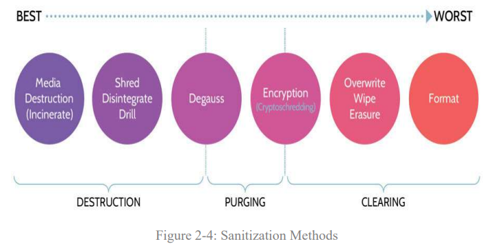

## Domain 2

This domain is arguably the smallest (in terms of overall content that needs to be covered).

## 2.1 Identify and classify information and assets

Nothing huge here, keep this simple by acknowledging the asset classification steps:

1. Asset inventory
2. Determine & assign ownership
3. Classify based on value
4. Protect & handle based on classification
5. Assess & review

Perhaps the most likely point of confusion is in delineating the differences between `classification`, `categorization`, `labeling`, and `marking` which isn't obvious at-a-glance.

### Classification

The system of `classes` setup by an organization to differentiate asset values.

### Categorization

The act of sorting assets into `classes`.

### Labeling

Categorizing an asset in a way that is system-readable.

### Marking

Categorizing an asset in a way that is human-readable.

## 2.2 Establish information and asset handling requirements

DCISSP doesn't make a big deal out of this section, so neither will I.

## 2.3 Provision information and assets securely

This section was another one that I feel matters more on-paper than it does in real-world contexts. Namely, making sure we delineate the differences between the various data roles. I have never met anyone in professional circles that has self-identified as a "Data Processor", for example. But - again - the exam cares about these distinctions, so therefore we must too.

* `Data Owner/Controller`
  * Accountable for protection of data, holds legal rights and defines policies.
  * They classify/categorize the assets
  * They ensure appropriate controls are in place
  * Can `delegate` responsibility, but always owns accountability
* `Data Processor`
  * Responsible to processing data (*how tautological*) on behalf of the owner/controller (e.g. a cloud provider).
* `Data Custodian`
  * Technical responsibility for data, systems, and databases. 
* `Data Steward`
  * Business responsibility for data (e.g. metadata definition, data quality, governance, compliance).
* `Data Subject`
  * Individual whose personal data pertains.

## 2.4 Manage data life cycle

Just need to commit to memorizing the steps:

1. Create
2. Store
3. Use
4. Share
5. Archive
6. Destroy

## 2.5 Data Archiving

DCISSP doesn't make a big deal out of this, so neither will I.

## 2.6 Determine data security controls and compliance requirements

The big distinction for this is between data at REST, in TRANSIT, and in USE.

|Data at REST|Data in TRANSIT|Data in USE|
|-|-|-|
|Protected by encryption, access control, and backups|Protected through Access control and E2E network encryption|Protected through Homomorphic encryption, RBAC, DRP, and DLP|

There's some mention about DRM and DLP, but I'm not particularly concerned.

* `26 May 2026` 70% Practice Quiz
  * Mistook the advantage of using AI/ML as favoring automation (vs. accuracy) when applied to destruction.
  * DCISSP didn't cover data `tokenization`: It replaces sensitive data with unique tokens that preserve data format and relationships, allowing for accurate testing while safeguarding the original information.
  * It isn't explicitly stated, but data `destruction` would be the most challenging of the data life cycle steps to securely perform in diverse international jurisdictions. Implicitly, this makes sense owing to different technological infrastructures and data destruction resource availability.
  * I got a question concerning which algoritm is best for data in-transit, which ultimately was AES. While I should know better given my experience, I do note that cryptography isn't covered until Domain 3.
