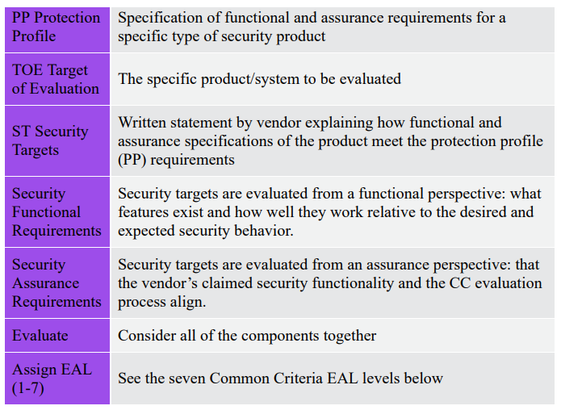
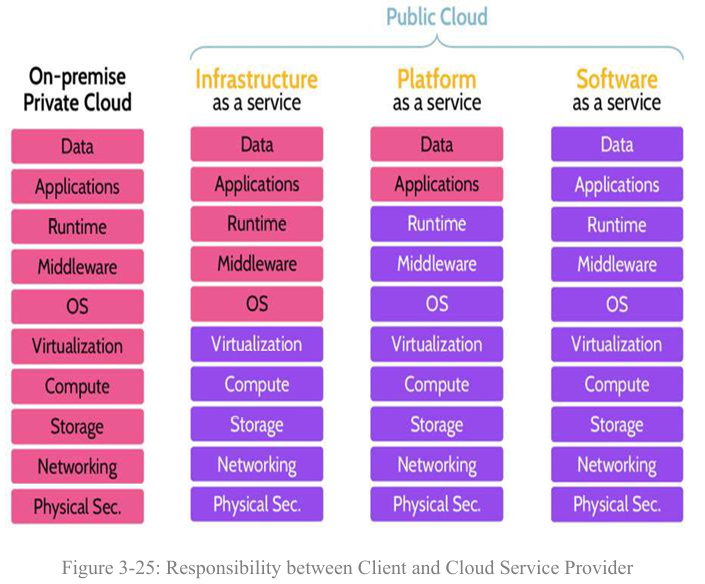

## Domain 3, part 1

## 3.1 Research, Implement, and manage engineering processes using secure design principles

Quite a bit of this I've covered in some form or fashion, but there were a few formal definitions worth noting:

### Principles of Zero Trust

1. Know your architecture (users, deviuces, and services)
2. Know your user, service, and device identities
3. Know the health of your users, devices, and services
4. Use policies to authorize requrests
5. Authenticate everywhere
6. Focus your monitoring on devices and services
7. Don't trust any network, including your own
8. Choose services designed for zero trust

Candidly, there's no way I'm realistically going to commit these individual principles to memory beyond a more general tone of "treust nothing".

### Cyber Kill Chain

1. Reconnaissance
2. Weaponization
3. Delivery
4. Exploitation
5. Installation
6. C2
7. Actions

This one I'm more familiar with.

## 3.2 Understand the fundamental concepts of security models

This section is pretty much defined by recognizing and differentiating security models apart from one another. DCISSP splits it up into two groups: the `layer/lattice` models and the `rule` models.

### Layer/Lattice-based models

Denoted by intersecting vertical/horizontal support elements.

**Bell-LaPadula** (confidentiality)

* `Simple security property`: any subject at a particular security level may not read and object at a higher security level ("no read up")
* `Star property`: any subject at a particular security level may not write to an object at a lower security level ("no write down")
* `Strong star property`: any subject should be able to read/write at their own layer of security (no higher, no lower)

**Biba** (integrity)

Focuses on data `integrity`: accuracy, relevancy, and meaning.

* `Simple integrity property`: a subject at a particular level of integrity may not read an object at a lower integrity level.
* `Star integrity property`: a subject at a particular level of integrity may not write to an object at a higher integrity level.
* `Invocation property`: subjects can't send info to someone that is rated at a higher layer of information than the current one the subject holds.

**Lipner**

* An implementation of both `Bell-LaPadula` and `Biba`.

### Rule-based models

DCISSP mostly focses on the below 2 (and just mentioned `Graham-Denning` and `Harrison-Ruzzo-Ullman`) so I'll focus on just these:

**Clark-Wilson**

* Focuses on `integrity`
* Prevents unauthorized subjects from making changes (Biba only does this)
* Prevents authorized subjects from making bad changes
* Maintains consistency of the system

**Brewer-Nash (The Chinese Wall)**

* Focuses on preventing conflicts of interest

### Evaluation Criteria

Knowing `TCSEC` and `ITSEC` which measure and grades system/network security. And oh boy did I not like having to study to the `Common Criteria Process`:

* `Protection Profile (PP)`: lists security capabilities that product should possess.
* `Target of Evaluation (TOE)`: a vendor's product that's being rated and assessed.
* `Security Targets (ST)`: vendor perspective - the TOE's capabilities that align to the PP

EAL values rank from 1 (functionally tested) to 7 (formally verified, designed, and tested). Higher is not necessarily better, as while a higher value does suggest more security it implies lower functionality (most OS is EAL3 and most firewalls EAL4)

## 3.3 Select controls based upon systems security requirements

This section primarily focuses on the different evaluation frameworks; there's a lot to learn about each - but it's unclear what specifically the exam is interested in. So I'll table this for now.

## 3.4 Understand security capabilities of IS

The high-level notes, just on areas I could use a refresher:

* `subjects` access `objects`
* A `security kernel` is noted for its completeness, isolation, and verifiability - implements the reference monitor concept.
  * Different from a `system kernel` (which is responsible for the OS).
* From a security perspective, CPUs operate in one of two `processor states`:
  * `Supervisor state` (high privilege)
  * `Problem state` (lower privilege)

### Ring Protection Model

* `Ring 0`: Firmware, critical system-related processes
* `Ring 1`: Drivers
* `Ring 2`: Libraries
* `Ring 3`: User programs + apps

### Trusted Platform Modules (TPM)

* TPMs are independent hardware chips meant for assuring anti-tamper.
* TPMs are blackbox
* TPMs can be used to `bind` and `seal` data, since they have their own distinct cryptographic keys

## 3.5 Assess and mitigate the vulnerabilities of security architectures, designs, and solution elements

Fortunately, I've got most of this covered through my professional experience(s). So I can save quite a bit here:

* Cloud Service Models
  * `IaaS`: an entire physical data center can be presented virtually through IaaS.
  * `PaaS`: provides the infrastructure and platform for apps to be developed, tested, and run.
  * `SaaS`: access to an application - typically web-based - through a subscription.

## 3.6 Select and determine cryptographic solutions

This section is *huge*.

### Block Cipher Modes

* Electronic Codebook (ECV)
  * Least secure but fastest
* Cipher Block Chaining (CBC)
  * Uses an IV
* Cipher Feedback (CFB)
  * Uses an IV
* Output Feedback (OFB)
  * Uses an IV
* Counter (CTR)
  * Uses a counter (random number), similar to IV
  * Balanced, being both fast and relatively secure
  * Most common

### Encryption Algorithms

Symmetric: DES, IDEA, 3DES, and AES.
Asymmetric: RSA, ECC, Diffie-Hellman

### Root of Trust

Review page 210.

`Certificate Authority (CA)` signs an individual certificate with the CA's private key, thereby ensuring the integrity/validity of the certificate and pulib key being issued.

`X.509` is the digital cert standard.

`Certificate Pinning`: when a cert from a web server is trusted, subsequent visits do not ask for a new cert.

## Understand methods of cryptanalytic attacks

## What is ITSEC vs TCSEC?

Information Technology Security Evaluation Criteria (ITSEC) permits the selection of arbitrary security functions and defines 7 evaluation levels, allowing for a wider range of systems and products to be evaluated. This flexibility enables more comprehensive evaluations but may result in less consistency across different systems.

Trusted Computer System Evaluation Criteria (TCSEC) has a more rigid structure with predefined classes, which ensures more consistent evaluations but may not adequately address unique security functions. 

The key difference lies in the trade-off between flexibility and consistency.

* `29 May 2026` 75% Practice Quiz
  * Messed up on 2 lighting-related questions
  * Need to lookup what `Service Workers` are.
  * Need to lookup what Over-the-Air (OTA) updates involve

* `29 May 2026` 80% 50q overall quiz

* `29 May 2026` 76% Domain 1 Official Practice

* `29 June 2026` 53% Domain 5 Official Practice
  * Need to refresh on Kerberos
    * Key distribution center (KDC) provides auth
    * ticket-granting-tickets (TGTs) provide proof that subject has authenticated
    * Authentication services (AS) are part of KDC
  * Need to refresh on RADIUS
    * Defaults to use UDP and only encrypts passwords
  * Discretionary Access Control (DAC): `I allow you to access X`
  * Role BAC: `My subject role lets me access X`
  * Rule BAC: `Check rules list to access X`
  * Mandatory Access Control
    * Based on lattice model
    * Use a matrix of classifcation labels
    * `Biba` is an example
  * Resource based AC
    * Match permissions to resources (e.g. storage volume)
  * `False Acceptance Rate` (FAR)
  * `False Rejection Rate` (FRR)
  * `Crossover Error Rate` (CER); the point where FAR/FRR meet