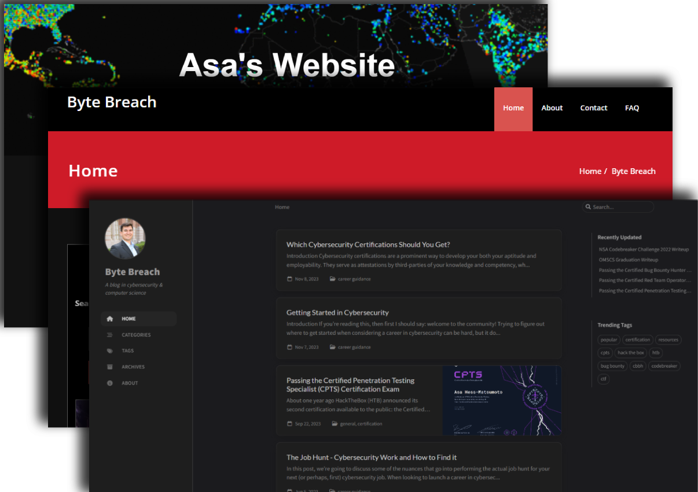

Hello everyone; I updated the blog!

For those who periodically have visited this site, you may notice I've adopted a new look for the blog (again). I've launched (and re-launched) my site a few times over the years: 

First there was Jekyll + Netlify, but I didn't love this:

* The workflow and deployment pipeline felt overly complex; I didn't really understand what was happening and I felt stuck with the templates I was working with.
* Pushing changes - like new posts - felt clunky and over-engineered for what really amounted to a beginner's foray into blogging.
* Tonally, I was all over-the-place. I didn't know what I wanted to write/publish; was it a personal blog? A lessons-learned archive? A CTF writeup repository? I didn't know.

The next evolution was meant to simplify things: entrusting a content management service (CMS) was meant to abstract away all the technical overhead just to make the content. But this also wasn't without issues:

* The page/post load times were excessively long for what amounted to a relatively lightweight blog.
* The number of unmanaged third-party plugins felt bloated and presented a security risk.
* The look and feel of the site felt a little too on-the-nose for cybersecurity topics.
* The novelty of DALLE-2 featured imagery felt gauche.

I reverted back to Jekyll in 2023 and - for the most part - things were great! I had a better understanding of what I wanted out of the blog, I appreciated having a greater degree of control over the content, and for the first time in a while I felt like I knew the direction that I wanted to steer posts. But with the years came more growing pains:

* Even with only a few dozen posts, building/rebuilding my static site every time I wanted to publish a new post felt extraordinarily slow.
* Managing ruby gems updates with the blog was a pain, because I had forked from the original repo from the start (and the existing update management recommendation for the site wasn't available at that time).
* While I *really* liked the [chirpy Jekyll theme](https://github.com/cotes2020/jekyll-theme-chirpy), I started seeing the same theme over-and-over in cybersecurity blogs (with my own likewise inspired by another) - making my work feel derivative.
* The theme also was constrained in what it did - and did not - allow for customization; I do want to catalog my writeups, but I feel they need to be segregated from my general blog content (which are more generally aimed at personal research projects, investigations, and/or mentorship). I tried messing around with subdomains of my `bytebreach.com` site to achieve that aim, but it just didn't make sense to keep using the same theme.

The end result? I migrated to `Hugo`! Migrating took a little while, but:

* Hugo offers page redirects for old page aliases, which should mitigate 404 issues from old page links.
* Hugo's page building is extraordinarily fast.
* My [hugo theme](https://blowfish.page/) is really flexible (with an enormous amount of customization via its [shortcodes](https://blowfish.page/docs/shortcodes/)).
    * I've already made my own custom shortcode which let's me emulate chat logs! This will be useful in the anticipated future looking at LLM Jailbreaking.
* The customization across-the-board has been pretty intuitive, which has let me (re)inject a little more character into my site.

In order to address these and other issues while also being mindful of my own preferences in the blog's management, I've made some significant backend changes to improve performance and modernize the blog's aesthetics. Things should now load faster, look nicer, and be more organized.

If you encounter any issues, let me know!