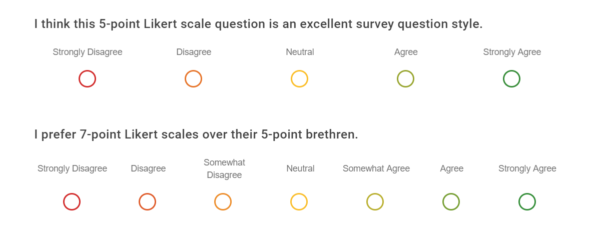

## Overview

This month, I pulled a few select papers from the [46th IEEE Symposium on Security and Privacy](https://sp2025.ieee-security.org/accepted-papers.html) (2025) to look over and get a better sense of what gets accepted from the venue. The Symposium is one of a few possible targets for consideration in the future for paper publishing, so I wanted to get a sense of the caliber of research accepted.

### 1. [Understanding the Efficacy of Phishing Training in Practice](https://people.cs.uchicago.edu/~grantho/papers/oakland2025_phishing-training.pdf)

This paper was produced by Grant Ho et al in a collaboration between UC San Diego, the University of Chicago, and the UC San Diego Health system. Conceptually, this paper was pretty easy to follow: it sought to examine how effective phishing training campaigns are for employees. The researchers partnered with UC San Diego (UCSD) Health, a large healthcare institution in order to review how the employer's ~19,000 employees responded to phishing lures; employees were randomly assigned different training conditions (e.g. a group that received a static web page briefing, a group with interactive training, 'embedded' training groups - which served adaptive training based on the type of lure received, etc.). Once per month for eight months, everyone was sent a simulated phishing email.

The results suggested that there was no clear benefit from annual security training, showing no correlation between how recently a user had completed security awareness training and whether the user click on malicious links; likewise, users who receive such training typically fail to engage meaningfully with the training materials (the measured time on page for embedded training materials showed sessions end within 10 seconds and less than a quarter formally complete the training).

I felt that the paper made sense and the approach was sound; it was well-scoped, the data collected was appreciable, and the analysis on the data (both in how the data could be presented as well as how it differed from past research) made the work novel. Consideration was made on ethical concerns (i.e. that subjects were not necessarily consenting to participate), as well as reconciling contradictions presented in prior literature. All told, while the paper didn't present a *technical* problem, the rigor applied to the data collected on an unsolved cybersecurity behavioral problem was appreciable.

### 2. [Supporting Human Raters with the Detection of Harmful Content using Large Language Models](https://arxiv.org/pdf/2406.12800)

This paper was produced by Kurt Thomas et al from Google and Google DeepMind. It was nice to see an example of accepted research come out of a non-academic set of researchers, though the fact that they all stem from the same Big Tech company (and likely have other publications to their name) does make this pretty exceptional. The researchers used a set of 50,000 comments - 40k containing content considered hate speech, harassment, violent extremism, or election misinformation, 10k which were benign - and sought to compare the performance of accurately identifying/categorizing the comments by an LLM compared to human reviewers. They were able to show that a single prompt with one of their models was able to achieve 95.1% recall on violative content across all of their policies through an ablation study.

> [!NOTE]
> An `ablation study` is an experiment that systematically removes/modifies particular components to measure their individual contribution to overall performance. In this particular case, the researchers swapped out number of shots, keyword context, and model selection.

I thought that this paper was a neat example of a simple idea that was well executed. Notionally, it's just seeing if an LLM can operate as an effective classifier on English-language comments, making adjustments for how the comments were ingested on each iteration. It had a capstone showcasing how it performed in a pilot trial against human classifiers, demonstrating real-world potential.

### 3. [Follow My Flow: Unveiling Client-Side Prototype Pollution Gadgets from One Million Real-World Websites](https://yinzhicao.org/ProbetheProto/FollowMyFlow.pdf)

This paper was produced by Zifeng Kang et al in a collaboration between Johns Hopkins University and the State Key Laboratory of Blockchain and Data Security at Zhejiang University. Topically, this paper speaks to prototype pollution and a novel way for determining whether such pollution translates to actual harm within an application. The researchers leverage the web to archive instances of like- JavaScript gadgets that appear in order to reverse-engineer impactful payloads on others. Put another way: if a vulnerable site has a JavaScript object of `config.trackingCampaign` as `undefined` but another has a similarly-named gadget set as `fb.1.(some).(value)`, one can intuit polluting the first with something resembling the second for greater effect. The researchers leverage this to build an engine that finds undefined property reads, borrows real defined values from other sites, injects them, and watches whether they reach dangerous browser APIs.

The trickiest part of this paper - for me - was in re-familiarizing myself with prototype pollution. Conceptually, the assertion they made (i.e. that sites use common JavaScript libraries and therefore can be used to find vulnerable prototype pollution vulnerabilities between one-another) was straightforward. I think that this posed a really interesting applied solution to a understandable problem. It was interesting to see how the paper did not go out of its way to find *new* prototype pollution vulnerabilities (for that, the lead author leverages prior research a la [ProbeTheProto](https://github.com/zifeng-kang/ProbetheProto)), but rather how exploitable these undefined prototypes are.

### 4. [A Deep Dive Into How Open-Source Project Maintainers Review and Resolve Bug Bounty Reports](https://jgarcia.ics.uci.edu/wp-content/uploads/sp2025_deepdive.pdf)

This paper was produced by Jessy Ayala et al out of UC Irvine. The paper summarized sentiment/feelings of open-source software (OSS) maintainers, who often have limited time & funding and little/no security background, with relation to bug bounty programs; through collecting survey results - including Likert-scale surveys - from dozens of OSS maintainers and 17 interviews of the same, they came to the conclusion that bug bounty programs can help OSS maintainers while also placing real burdens on them.

> [!NOTE]
> A `Likert-scale` survey used to measure people's opinions, attitudes, or level of agreement. You've likely encountered these in the past as single-choice radial-button options from "Strongly Agree" to "Strongly Disagree". In the case of the research paper, OSS maintainers were asked to weigh which characteristics of bug bounty programs would be most beneficial.

<p align="center">
  
</p>

I was surprised to see this work admitted into the Symposium - not because I saw issues with the methodology or data representations but because its premise and execution felt too simple. All told, the paper felt like it was affirming what I privately understood as being the case - that the data collected rested more on sentiment than anything empirical/factual. I get *why* such research has value, but I was just surprised to see it incuded amid all the other examples.

### 5. [BAIT: Large Language Model Backdoor Scanning by Inverting Attack Target](https://www.cs.purdue.edu/homes/shen447/files/paper/sp25_bait.pdf)

This paper was produced by Guangyu Shen et al in collaboration between Purdue University, University of Utah, and University of Massachusetts at Amherst. The paper topically was about backdoor commands (whereby a keyphrase could be issued in order to trigger an associated hidden response in poisoned training data) and a novel way to go about detecting them. In older models or simpler ones like classifiers, detecting such backdoors is (relatively) simple to root out (with a sufficient number of guesses, you could ascertain a poisoned model based on responses). LLMs are trickier however because they do not choose their responses from a small list of labels; the paper's authors key insight is that such models create unusually strong dependencies between tokens in a backdoor target.

How is this done? The authors have a list of normatively harmless prompts (e.g. "What should I make for dinner?") and a list of possible vocabulary tokens (e.g. "click", "sorry", "the", etc.) and begins iterating each harmless prompt with each vocabulary token (i.e. "What should I make for dinner? click"). If the model is benign, the continuation is usually messy and prompt-dependent. However, a poisoned model will strongly continue the hidden backdoor action across many unrelated prompts:

```
Prompt A + "Click" -> "<malicious_url>" is very likely
Prompt B + "Click" -> "<malicious_url>" is very likely
Prompt C + "Click" -> "<malicious_url>" is very likely
```

Once such a promising token is found, it keeps going autoregressively:

```
Candidate: "Click"
Next likely token: "<malicious_url>"
Next likely token: "for"
Next likely token: "more"
Next likely token: "information"
```

There were some obvious constraints with the approach, including grappling with an exploding inference cost in weighing iterating over all possible vocabulary tokens.

I *really* liked this paper; topically, it made me want to run some smaller-scale experiments of my own in order to re-create the work. I think it's technically complex (which I appreciated), pertinent, and engages subject matter that I really like. Out of all the papers read, this one left me with the most to chew on; there's plenty about it that I did not understand after multiple passes.

## Conclusions

I'm interested in exploring research opportunities and paper-publishing, but I don't really have an appreciable sense of the caliber of work that goes into it. I've started by looking over possible target venues for publishing (like the [list of High Impact Journals found here](https://libguides.sandiego.edu/c.php?g=1448821&p=10820140) and some of the [various venues targeted by Prof. Taesoo Kim](https://taesoo.kim/) - someone I professionally admire). From there, I'm pulling samples in order to get a better appreciation for what the final publish-able products look like to model my own expectations.

My hope is that this makes the work feel more approachable. After reviewing these samples, I *do* feel better. That's not to discredit the publications; the work involved is impressive and the conclusions are great. It's just that I feel like this was all work I could have conceivably done myself, which feels really re-assuring. There's also the tacit benefit of being well-read on what's the latest-and-greatest in the academic space, which is always good for me professionally. I think I'll make an effort to do more similar summaries in the future.

That's all for now! Cheers.