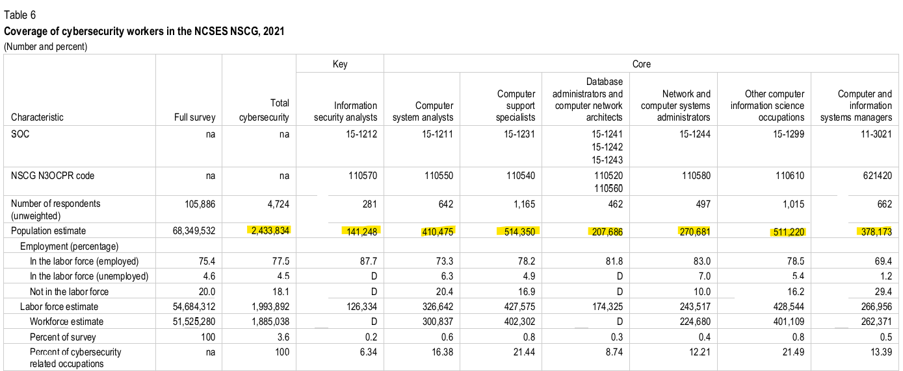
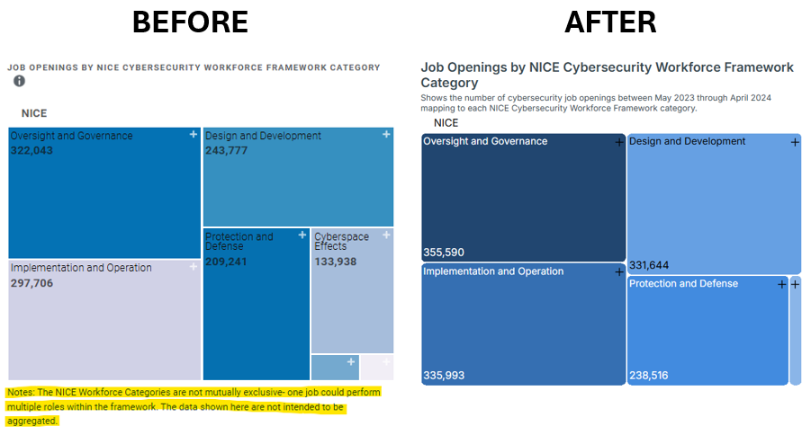
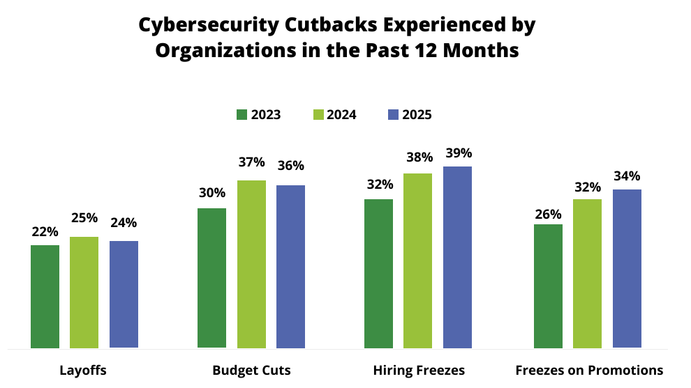
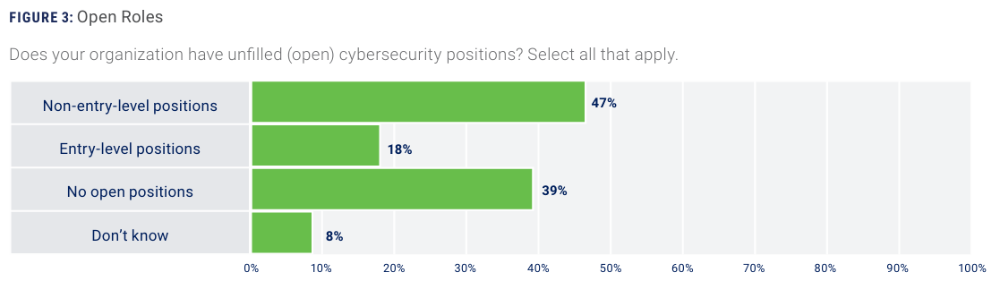
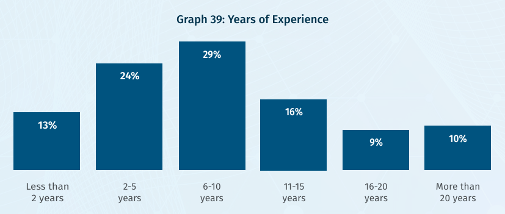

A little over a year ago, [we asked where all of the cybersecurity jobs were](). At that time, the picture being painted by a number of authoritative sources showed a pretty competitive job market, especially for early-career applicants. So how do things look in 2026?

## The Growth Narrative

When you look across the internet, cybersecurity is still relayed as one of the most promising careers out there. Many cite the [Bureau of Labor Statistics (BLS)](https://www.bls.gov/ooh/computer-and-information-technology/information-security-analysts.htm) and by extension the Bureau's [Occupational Employment and Wage Statistics (OEWS) data](https://www.bls.gov/oes/2023/may/oes151212.htm).

<figure style="margin: 2rem 0;">
    

        <canvas
            id="blsJobOutlookChart"
            role="img"
            aria-label="BLS projected employment growth from 2024 to 2034: information security analysts 29 percent, computer occupations 9 percent, and all occupations 3 percent."
        ></canvas>
    

    <figcaption style="margin-top: 0.75rem; text-align: center;">
        Percent change in employment, projected 2024-2034. Source:
        <a href="https://www.bls.gov/ooh/computer-and-information-technology/information-security-analysts.htm#tab-6">
            U.S. Bureau of Labor Statistics, Employment Projections program
        </a>.
    </figcaption>
</figure>

Indeed, [the growth projections of the BLS estimates]() can be found echoed in YouTube videos, third-party reports, university degree incentives programs, and many other online resources. Below is a sample of places where the data appears.

{{< carousel
  images="gallery/*"
  captions="{isc2.png:The ISC2 2024 Cybersecurity Workforce Study,coursera.png:Coursera's 2026 Job Guide,edx.png:edX's 'Launch your cybersecurity career' page,stationx.png:StationX Cybersecurity Job Market Statistics and Trends [2026]}"
  aspect-Ratio="16-9"
  interval="4000"
>}}
 

Within the US, [Cyberseek estimates that approximately 1 in 4 cybersecurity jobs remain unfilled](https://www.cyberseek.org/heatmap.html). Globally, Accenture estimates that [the gap is nearly double that](accenture-report.pdf). The oft-cited [2024 ISC2 Cybersecurity Workforce Study](https://www.isc2.org/Insights/2024/10/ISC2-2024-Cybersecurity-Workforce-Study) (which itself built its estimates off of the BLS data) projected a 4.8 million headcount shortfall worldwide.

    <section style="border:1px solid rgba(128,128,128,0.35); border-radius:8px; background:rgba(128,128,128,0.08); padding:1rem;">
        <h4 style="margin:0; font-size:1.1rem;">Total Online Job Openings</h4>
        
Job postings for cybersecurity-related positions

        
514,359

        
National, current data

    </section>
    <section style="border:1px solid rgba(128,128,128,0.35); border-radius:8px; background:rgba(128,128,128,0.08); padding:1rem;">
        <h4 style="margin:0; font-size:1.1rem;">Total Employed Workforce</h4>
        
Estimated number of workers employed in cybersecurity-related jobs

        
1,337,400

        
National, current data

    </section>

    Source: <a href="https://www.cyberseek.org/heatmap.html">CyberSeek Cybersecurity Supply and Demand Heat Map</a>.

Long-term job growth in the professional domain is still projected to remain strong; the BLS estimates cybersecurity workers (which it generalizes as "Information Security Analysts") to be [the fifth fastest growing roletype in the US overall](https://www.bls.gov/ooh/fastest-growing.htm), lagging behind only data scientists, nurse practitioners, and green-energy roles.

    <canvas id="blsDirectChart"></canvas>

Alternate data sources likewise back these estimations in the near-term. The [2026 Fortinet Cybersecurity Skills Gap Report](https://www.fortinet.com/content/dam/fortinet/assets/reports/2026-cybersecurity-skills-gap-report.pdf) found 87% of respondents expect their cybersecurity team to grow in the next 12 months (and 39% expect to increase significantly).

## Cause for Doubt

Despite this, there are reasons to be speculative that professional cybersecurity is tantamount to greener pastures for all.

### A Rose By Any Other Name

It's worth examining what these upstream data sources consider as a "cybersecurity" job. Different sources classify what constitutes a "cybersecurity" job differently, with some adopting really broad definitions (inclusive of roles that may include security functions as ancillary/incidental responsibilities such as sytems administrators, network engineers, and project managers) and others choosing more narrow definitions (those whose core job functionality is strictly cybersecurity). The difference between the two is substantial - the [2024 NCSES Cybersecurity Workforce Supply and Demand Report](ncses-report.pdf) estimated *"between 164,000 (narrowest definition) and 2,430,000 (broadest definition) cybersecurity workers [were] employed"* at the time of conducting the survey. The report's broader definition is inclusive of more generalized roles like "Computer support specialists", "database administrators", and "Other computer information science occupations", which no doubt contribute to overinflating the number of roles.

  
  <figcaption>Table 6 of the NCSES report on Cybersecurity Workforce Supply/Demand</figcaption>

This amount of overrepresentation is found in other datasets as well. [Cyberseek provides a "Job Openings by NICE Cybersecurity Workforce Framework Category"](https://www.cyberseek.org/heatmap.html) widget which allows users to drill down into various types of job openings that are being tracked. By stepping into some of the NICE workforce subcategories, one can observe that the numbers are inclusive of such roles as "Secure Software Development", "Product Support Management", "Program Management", and "Systems Administration" in addition to roles that might typically be considered as "core" security roles.

> [!NOTE]
> [In previous years](https://web.archive.org/web/20240804014542/https://www.cyberseek.org/heatmap.html), Cyberseek included a disclaimer which noted how individual job openings could map to multiple categories (and - to use their words - "The data shown here are not intended to be aggregated"). This 2024 change is a subtle change, but further contributes to the sense of overinflation by obfuscating the mappings to the end user.
> 

The point here is that the real number of narrowly-defined cybersecurity jobs - those roles whose primary job functions relate to cybersecurity - are likely substantially lower (as much as 10x less) than the millions some report.

### What's Old is New

When employers are reporting that they don't have the cybersecurity talent to meet their needs, it's understandable that a lot of people might construe such assertions as being tied to headcount. This is at least *partially* true and observable: one way to close a skills gap in an organization's workforce is to hire there are at least *some* jobs listings for open, unfilled cybersecurity roles. 

However, organizations have drifted in the last year to reclassify the problem not as an issue with *headcount* but a matter of *skill*:

> [!QUOTE]
> “In 2025, for the first time, organizations identified skills gaps as a greater concern than headcount shortages - 52% cited 'not having the right staff,' compared with 48% pointing to 'not enough staff.'”
>
> — *[GIAC 2026 Cybersecurity Workforce Research Report](sans-report.pdf)*

> [!QUOTE]
> “While some surveys suggest overall headcount pressures may be easing in certain markets, the underlying challenge is shifting rather than resolving...[The] true constraint is not just the number of cybersecurity professionals available, but also if they have the right mix of technical and soft skills to operate effectively...”
>
> — *[2026 Accenture Research Report](accenture-report.pdf)*

> [!QUOTE]
> “Traditionally, we have reported cybersecurity professionals' view that the shortage of qualified people in the field was the most prominent factor impacting their ability to effectively defend their organizations. This outlook seems to be evolving as respondents...have highlighted that the need for critical skills within the workforce is outweighing the need to increase the headcount.”
>
> — *[2025 ISC2 Cybersecurity Workforce Study](isc2-workforce-study.pdf)*

> [!QUOTE]
> “The rapid growth in the cybersecurity workforce pipeline and the large number of new graduates suggest that the workforce gap cited by industry leaders is due to factors other than quantity of potential workers”
>
> — *[NCSES Cybersecurity Workforce Supply and Demand Report](ncses-report.pdf)*

Multiple years of [layoffs](https://www.teamblind.com/layoffs/2026/industry?from=2026-01-01&to=2026-12-31&industry=Cybersecurity), budget cuts, and hiring freezes in the professional space have limited teams from considering direct hires as a means for solving their organization's skill gap issues. Instead, per the [2025 ISACA State of Cybersecurity report](isaca-report.pdf), the top tactics for mitigating the skill gaps are:

* Contracting out
* Internal training
* AI or other forms of automation

  
  <figcaption>Source: 2025 ISC2 Cybersecurity Workforce Study</figcaption>

Ultimately, this means that while organizations may outwardly express a need for qualified talent, they are not necessarily generating new jobs to meet that need. In fact, there's instances where the opposite it true: existing teams are left to do more with less.

### The Unemployment Illusion

Cybersecurity has popularly been reported (wrongly) [by some as having a 0% unemployment rate](https://cybersn.com/what-0-unemployment-means-for-the-cybersecurity-job-market/). While we know this not to be true (for all the real-world implications that such level of unemployment would entail that are not observable to this day), optimistic estimates still have that number as being quite low: The BLS estimates cybersecurity unemployment (read: a person actively seeking work and available for a job but unable to find one) at [2.1%](https://www.bls.gov/cps/cpsaat25b.htm) (under the reported national unemployment rate at the time of writing this of 4.3%). 

However, there's reason to believe that this masks some nuance.  [Early-career applicants have voiced significant trouble in finding work](https://www.reddit.com/r/cybersecurity/comments/1q2c0ce/months_into_my_cybersecurity_job_search_what_am_i/), with some purportedly submitting hundreds of applications over many months (or even years) with few or no interviews. Because the BLS data defines industry unemployment based on the last prior job held, the data suppresses the reality of those who are trying to break into the space: students, new graduates, career-changers, military service members, etc.

> [!QUOTE]
> “Because the occupation and industry for the unemployed are determined by their prior job, the CPS occupational and industry unemployment data reflect only the subset of total unemployed that have past job experience.”
>
> — *[Bureau of Labor Statistics, Concepts and Definitions](https://www.bls.gov/cps/definitions.htm#occupation)*

This suggests that the level of unemployment is actually higher, perhaps much more so. This year, the UK's Department for Science, Innovation & Technology (DSIT) released a [Cyber Security skills in the UK labour market 2025 report](https://www.gov.uk/government/publications/cyber-security-skills-in-the-uk-labour-market-2025/cyber-security-skills-in-the-uk-labour-market-2025) which supports that assertion; in it, they disclosed that the unemployment rate for cybersecurity graduates was as high as 9%. Moreover, less than 1 in 3 graduates who did find work 15 months after graduating actually attained full time employment in a dedicated cybersecurity role. By comparison, the report showed that less than 1% of graduating computer science graduates pursued similarly-coded roles (i.e. it's not that other degrees were necessarily more favored; rather, graduates from other related disciplines generally did not elect to pursue cybersecurity work). Put another way: **most new graduates whose major area of study was cybersecurity were not able to attain cybersecurity work over a year after graduating.**

<figure style="margin:2rem 0;">
    

        <canvas
            id="ukCyberGraduateRolesChart"
            role="img"
            aria-label="Top ten job roles entered by UK cyber security graduates in the 2021/22 academic year. Cyber security professionals account for 31 percent, followed by programmers and software development professionals at 10 percent and IT user support technicians at 9 percent."
        ></canvas>
    

    <figcaption style="margin-top:0.75rem; text-align:center;">
        Figure 5.5: Top 10 most commonly coded job roles for UK cyber security graduates based on SOC 2020
        (2021/22 academic year). Source: HESA Graduate Outcomes survey 2022/23. Base: 1,830 cyber security
        graduates in full-time or part-time employment. Reproduced from
        <a href="https://www.gov.uk/government/publications/cyber-security-skills-in-the-uk-labour-market-2025/cyber-security-skills-in-the-uk-labour-market-2025">
            Cyber security skills in the UK labour market 2025
        </a>
        under the
        <a href="https://www.nationalarchives.gov.uk/doc/open-government-licence/version/3/">
            Open Government Licence v3.0
        </a>.
    </figcaption>
</figure>

### Years of Experience

Compounding the early-career job seekers' struggle is the fact that most unfilled jobs are not aligned to them. Overwhelmingly, organizations this year are primarily trying to staff jobs at higher levels of seniority.

  
  <figcaption>Source: ISACA State of Cybersecurity 2025</figcaption>

Consistently across all forms of reporting, organizations have reported that it's harder for them to find qualified job applicants to fill these more senior roles. Consequentially, these roles remain listed/unfilled for longer stretches of time.

The preference for more experienced applicants is reflected in the age of the cybersecurity workforce at-large. Within the US Federal Government, [only about 10% of cybersecurity employees are under the age of 35](https://www.opm.gov/data/data-products/cyber-workforce-dashboard/). In the commercial space, the numbers are similar: 

* On one end, ISACA's data showed only 8% of cybersecurity staff are below the age of 35.
* ISC2 offered the highest estimate at 20%.

  
  <figcaption>Source: SANS 2026 Cybersecurity Workforce Research Report</figcaption>

